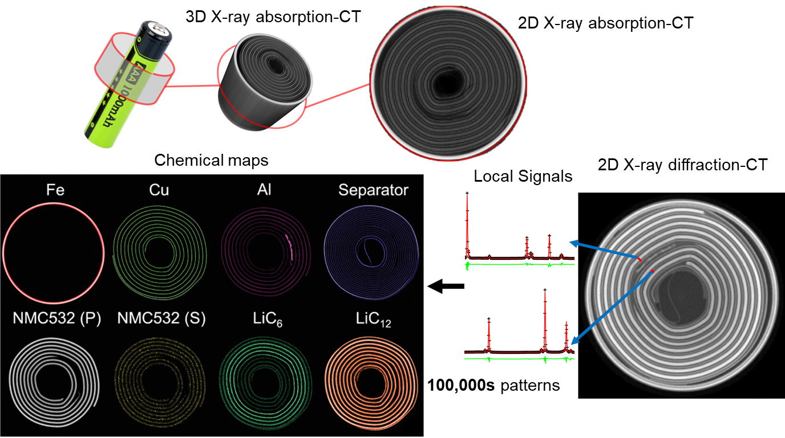

nDTomo Software Suite
=====================

**nDTomo** is a Python-based software suite for the **simulation, visualization, pre-processing, reconstruction, and analysis** of chemical imaging and X-ray tomography data — with a focus on hyperspectral datasets such as XRD-CT (X-ray Diffraction Computed Tomography).

It includes:

- A suite of **notebooks and scripts** for advanced processing, sinogram correction, CT reconstruction, peak fitting, and machine learning-based analysis
- A **PyQt-based graphical user interface (GUI)** for interactive exploration and analysis of hyperspectral tomography data
- A growing collection of **simulation tools** for generating phantoms and synthetic datasets

The software is designed to be accessible to both researchers and students working in chemical imaging, materials science, catalysis, battery research, and synchrotron radiation applications.

📘 Official documentation (in progress): https://ndtomo.readthedocs.io

---

Key Capabilities
----------------

nDTomo provides tools for:

1. **Interactive visualization of chemical tomography data** via the `nDTomoGUI`
2. **Generation of multi-dimensional synthetic phantoms**
3. **Simulation of pencil beam CT acquisition strategies**
4. **Pre-processing and correction of sinograms**
5. **CT image reconstruction** using algorithms like filtered back-projection and SIRT
6. **Dimensionality reduction and clustering** for unsupervised chemical phase analysis
7. **Pixel-wise peak fitting** using Gaussian, Lorentzian, and Pseudo-Voigt models

<<<<<<< HEAD
**Quick Demo (Tomography Reconstruction)**: [](https://colab.research.google.com/github/epapoutsellis/nDTomo/blob/gcolab/gcolab/tutorial_ct_recon_demo.ipynb)    


The aim of this library, among others, is to generate tools for the following:
1. **Generation of multi-dimensional phantoms**
2. **Simulation of various pencil beam computed tomography data acquisition strategies**
3. **Processing and correcting sinogram data**
4. **Application of computed tomography reconstruction algorithms**
5. **Data analysis of chemical imaging data through peak fitting**
=======
>>>>>>> master


Figure: Comparison between X-ray absorption-contrast CT (or microCT) and X-ray diffraction CT (XRD-CT or Powder diffraction CT) data acquired from an NMC532 Li ion battery. For more details regarding this study see [1].

---

Included Tutorials
------------------

The repository includes several **example notebooks** to help users learn the API and workflows:

| Notebook Filename                                   | Topic                                                                 |
|-----------------------------------------------------|------------------------------------------------------------------------|
| `tutorial_2D_shapes.ipynb`                          | Generating and visualizing 2D phantom shapes                          |
| `tutorial_3D_shapes.ipynb`                          | Building synthetic 3D chemical imaging datasets                       |
| `tutorial_pencil_beam.ipynb`                        | Simulating pencil beam CT data with different acquisition schemes     |
| `tutorial_sinogram_handling.ipynb`                  | Pre-processing, normalization, and correction of sinograms            |
| `tutorial_ct_recon_demo.ipynb`                      | CT image reconstruction from sinograms using analytical and iterative methods |
| `tutorial_peak_fitting.ipynb`                       | Peak fitting in synthetic XRD-CT datasets                             |
| `tutorial_dimensionality_reduction.ipynb`           | Unsupervised learning for phase identification in tomography          |
| `Detector_calibration_Integration_of_2D_powder_diffraction.ipynb` | Calibrating detectors and integrating 2D powder diffraction patterns using pyFAI |
| `Texture_2D_powder_diffraction_patterns.ipynb`      | Investigating the effects of texture on 2D powder patterns            |

Each notebook is designed to be **standalone and executable**, with detailed inline comments and example outputs.

---

Graphical User Interface (nDTomoGUI)
------------------------------------

The `nDTomoGUI` provides a complete graphical environment for:

- Loading `.h5` / `.hdf5` chemical imaging datasets
- Visualizing 2D slices and 1D spectra interactively
- Segmenting datasets using channel selection and thresholding
- Extracting and exporting local diffraction patterns
- Performing single-peak batch fitting across regions of interest
- Generating synthetic phantoms with real reference spectra
- Using an embedded IPython console for advanced control and debugging

The GUI is described in more detail in the [online documentation](https://ndtomo.readthedocs.io) and supports both novice and expert workflows.

Launch with:

```bash
conda activate ndtomo
nDTomoGUI
```

Installation instructions
-------------------------
An important part of the code is based on astra-toolbox (and tomopy) which is currently available through conda so to make your life easier please install anaconda. It is possible to install astra-toolbox/tomopy from sources (i.e. if one wants to avoid using conda) but it is not a trivial task. I suggest you create a new anaconda environment for nDTomo (e.g. using the anaconda navigator) and make sure to install first the IDEs (Jupyter lab, Spyder etc) before installing the nDTomo.

1. **Install nDTomo from GitHub**

Create a new environment:

```
conda create --name ndtomo python=3.9
conda activate ndtomo
```

To install from git:

```
pip install git+https://github.com/antonyvam/nDTomo.git
```

For development work:

```
git clone https://github.com/antonyvam/nDTomo.git && cd nDTomo
pip install -e .
```

For local installation, using the flag --user:

```
pip install --user -e .
```

or:

```
python3 setup.py install --user
```

For example, as a user at the Diamond Light Source:

```
git clone https://github.com/antonyvam/nDTomo.git && cd nDTomo
module load python/3
python setup.py install --user
```

2. **Install pytorch**

For Windows/Linux with CUDA 11.8:
```
pip install torch torchvision torchaudio --index-url https://download.pytorch.org/whl/cu118
```

3. **Install astra-toolbox**

```
conda install -c astra-toolbox -c nvidia astra-toolbox
```


## Launching the GUI

After installing `nDTomo`, the graphical user interface can be launched directly from the terminal:

```bash
conda activate ndtomo
nDTomoGUI
```


Citation
--------
If you use parts of the nDTomo code, please cite the work using the following:

Vamvakeros, A. et al., nDTomo software suite, 2019, DOI: https://doi.org/10.5281/zenodo.6344270, url: https://github.com/antonyvam/nDTomo


References
----------

[1] A. Vamvakeros, D. Matras, T.E. Ashton, A.A. Coelho, H. Dong, D. Bauer, Y. Odarchenko, S.W.T. Price, K.T. Butler, O. Gutowski, A.‐C. Dippel, M. von Zimmerman, J.A. Darr, S.D.M. Jacques, A.M. Beale, Small Methods, 2100512, 2021, https://doi.org/10.1002/smtd.202100512
