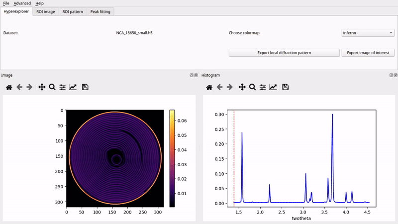

# nDTomo Software Suite

**nDTomo** is a Python-based software suite for the **simulation, visualization, pre-processing, reconstruction, and analysis** of chemical imaging and X-ray tomography data, with a focus on hyperspectral datasets such as X-ray powder diffraction computed tomography or XRD-CT.

It includes:

- A suite of **notebooks and scripts** for advanced processing, sinogram correction, CT reconstruction, peak fitting, and machine learning-based analysis
- A **PyQt-based graphical user interface (GUI)** for interactive exploration and analysis of hyperspectral tomography data
- A growing collection of **simulation tools** for generating phantoms and synthetic datasets

The software is designed to be accessible to both researchers and students working in chemical imaging, materials science, catalysis, battery research, and synchrotron radiation applications.

📘 Official documentation: https://ndtomo.readthedocs.io



## Key Capabilities

nDTomo provides tools for:

1. **Interactive visualization of chemical tomography data** via the `nDTomoGUI`
2. **Generation of multi-dimensional synthetic phantoms**
3. **Simulation of pencil beam CT acquisition strategies**
4. **Pre-processing and correction of sinograms**
5. **CT image reconstruction** using algorithms like filtered back-projection and SIRT
6. **Dimensionality reduction and clustering** for unsupervised chemical phase analysis
7. **Pixel-wise peak fitting** using Gaussian, Lorentzian, and Pseudo-Voigt models
8. **Peak fitting using the self-supervised PeakFitCNN**
9. **Simultaneous peak fitting and tomographic reconstruction using the DLSR approach** with PyTorch GPU acceleration


*Figure: Comparison between X-ray absorption-contrast CT (or microCT) and X-ray diffraction CT (XRD-CT or Powder diffraction CT) data acquired from an NMC532 Li ion battery. For more details regarding this study see [1].*

## Included Tutorials

The repository includes several **example notebooks** to help users learn the API and workflows:

[](https://mybinder.org/v2/gh/epapoutsellis/nDTomo/cloud_exs?urlpath=%2Fdoc%2Ftree%2Fdocs%2Fsource%2Fnotebooks) [](https://colab.research.google.com/github/epapoutsellis/nDTomo/blob/cloud_exs/gcolab/tutorial_ct_recon_demo.ipynb)

| Notebook Filename | Topic |
|------------------|--------|
| [`tutorial_phantoms.ipynb`](docs/source/notebooks/tutorial_phantoms.ipynb) | Generating and visualizing 2D/3D phantoms |
| [`tutorial_pencil_beam.ipynb`](docs/source/notebooks/tutorial_pencil_beam.ipynb) | Simulating pencil beam CT data with different acquisition schemes |
| [`tutorial_detector_calibration.ipynb`](docs/source/notebooks/tutorial_detector_calibration.ipynb) | Calibrating detectors and integrating diffraction patterns using pyFAI |
| [`tutorial_texture_2D_diffraction_patterns.ipynb`](docs/source/notebooks/tutorial_texture_2D_diffraction_patterns.ipynb) | Investigating the effects of texture on 2D powder patterns |
| [`tutorial_sinogram_handling.ipynb`](docs/source/notebooks/tutorial_sinogram_handling.ipynb) | Pre-processing, normalization, and correction of sinograms |
| [`tutorial_ct_recon_demo.ipynb`](docs/source/notebooks/tutorial_ct_recon_demo.ipynb) | CT image reconstruction from sinograms using analytical and iterative methods |
| [`tutorial_dimensionality_reduction.ipynb`](docs/source/notebooks/tutorial_dimensionality_reduction.ipynb) | Unsupervised learning for phase identification in tomography |
| [`tutorial_peak_fitting.ipynb`](docs/source/notebooks/tutorial_peak_fitting.ipynb) | Peak fitting in synthetic XRD-CT datasets |
| [`tutorial_peak_fit_cnn.ipynb`](docs/source/notebooks/tutorial_peak_fit_cnn.ipynb) | Peak fitting in GPU using a self-supervised PeakFitCNN |
| [`tutorial_DLSR.ipynb`](docs/source/notebooks/tutorial_DLSR.ipynb) | Simultaneous peak fitting and CT reconstruction in GPU using the DLSR method |

Each notebook is designed to be **standalone and executable**, with detailed inline comments and example outputs.

**Note:**

- **Binder** is built with CPU-only support (including `torch`) and can be used to run all notebooks. However, some notebooks may take longer to execute due to the lack of GPU acceleration.

- **Google Colab** provides GPU support and `torch` is preinstalled. You will also need to install `nDTomo` at the beginning of each notebook session.

## Graphical User Interface (nDTomoGUI)

The `nDTomoGUI` provides a complete graphical environment for:

- Loading `.h5` / `.hdf5` chemical imaging datasets
- Visualizing 2D slices and 1D spectra interactively
- Segmenting datasets using channel selection and thresholding
- Extracting and exporting local diffraction patterns
- Performing single-peak batch fitting across regions of interest
- Generating a synthetic XRD-CT phantoms for development tests
- Using an embedded IPython console for advanced control and debugging

The GUI is described in more detail in the [online documentation](https://ndtomo.readthedocs.io) and supports both novice and expert workflows.

Launch with:

```bash
conda activate ndtomo
nDTomoGUI
```

## Installation Instructions

To make your life easier, please install [Anaconda](https://www.anaconda.com/products/distribution). The `nDTomo` library and all associated ode can be installed by following the next three steps:

### 1. Install nDTomo from GitHub

Create a new environment:

```bash
conda create --name ndtomo python=3.9
conda activate ndtomo
```

#### To install using Git:

```bash
pip install git+https://github.com/antonyvam/nDTomo.git
```
For development work (editable install):

```bash
git clone https://github.com/antonyvam/nDTomo.git && cd nDTomo
pip install -e .
```

#### For local installation after downloading the repo:

Navigate to where the `setup.py` file is located and run:

```bash
pip install --user .
```

or:

```bash
python3 setup.py install --user
```

### 2. Install PyTorch

The neural networks, as well as any GPU-based code, used in `nDTomo` require Pytorch which can be installed through pip.

For example, for Windows/Linux with CUDA 11.8:

```bash
pip install torch torchvision torchaudio --index-url https://download.pytorch.org/whl/cu118
```

### 3. Install astra-toolbox

An important part of the code is based on astra-toolbox, which is currently available through conda.

It is possible to install astra-toolbox from sources (i.e., if one wants to avoid using conda), but it is not a trivial task. We recommend creating a new conda environment for `nDTomo`.

```bash
conda install -c astra-toolbox -c nvidia astra-toolbox
```

## Launching the GUI

After installing `nDTomo`, the graphical user interface can be launched directly from the terminal:

```bash
conda activate ndtomo
nDTomoGUI
```

## Diamond Light Source

As a user at the Diamond Light Source, you can install `nDTomo` by doing:

```bash
git clone https://github.com/antonyvam/nDTomo.git && cd nDTomo
module load python/3
python setup.py install --user
```

## Citation

We are currently preparing a manuscript for `nDTomo`. In the meantime, if you use parts of the code, please cite the work using the following:

Vamvakeros, A., Papoutsellis, E., Dong, H., Docherty, R., Beale, A.M., Cooper, S.J., Jacques, S.D.M.J., *nDTomo: A Python-Based Software Suite for X-ray Chemical Imaging and Tomography*, 2025, https://github.com/antonyvam/nDTomo

## References

[1] A. Vamvakeros, D. Matras, T.E. Ashton, A.A. Coelho, H. Dong, D. Bauer, Y. Odarchenko, S.W.T. Price, K.T. Butler, O. Gutowski, A.-C. Dippel, M. von Zimmerman, J.A. Darr, S.D.M. Jacques, A.M. Beale, *Small Methods*, 2100512, 2021. https://doi.org/10.1002/smtd.202100512
