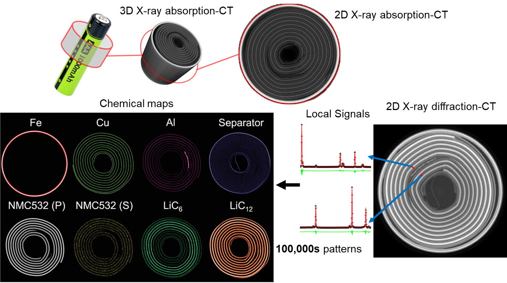

nDTomo software suite
=====================

**nDTomo** is a Python-based software suite for the **simulation, visualization, pre-processing, reconstruction, and analysis** of chemical imaging and X-ray tomography data — with a focus on hyperspectral datasets such as XRD-CT (X-ray Diffraction Computed Tomography).

It includes:

- A suite of **notebooks and scripts** for advanced processing, sinogram correction, CT reconstruction, peak fitting, and machine learning-based analysis
- A **PyQt-based graphical user interface (GUI)** for interactive exploration and analysis of hyperspectral tomography data
- A growing collection of **simulation tools** for generating phantoms and synthetic datasets

The software is designed to be accessible to both researchers and students working in chemical imaging, materials science, catalysis, battery research, and synchrotron radiation applications.

.. image:: _static/nDTomo_demo1.gif
   :alt: nDTomo GUI Demo
   :align: center

Key Capabilities
----------------

nDTomo provides tools for:

1. **Interactive visualization of chemical tomography data** via the `nDTomoGUI`
2. **Generation of multi-dimensional synthetic phantoms**
3. **Simulation of pencil beam CT acquisition strategies**
4. **Pre-processing and correction of sinograms**
5. **CT image reconstruction** using algorithms like filtered back-projection and SIRT
6. **Dimensionality reduction and clustering** for unsupervised chemical phase analysis
7. **Pixel-wise peak fitting** using Gaussian, Lorentzian, and Pseudo-Voigt models

Figure: Comparison between X-ray absorption-contrast CT (or microCT) and X-ray diffraction CT (XRD-CT or Powder diffraction CT) data acquired from an NMC532 Li ion battery. For more details regarding this study see [1].

Graphical User Interface (nDTomoGUI)
------------------------------------

The `nDTomoGUI` provides a complete graphical environment for:

- Loading `.h5` / `.hdf5` chemical imaging datasets
- Visualizing 2D slices and 1D spectra interactively
- Segmenting datasets using channel selection and thresholding
- Extracting and exporting local diffraction patterns
- Performing single-peak batch fitting across regions of interest
- Generating synthetic phantoms with real reference spectra
- Using an embedded IPython console for advanced control and debugging

References
^^^^^^^^^^

[1] A. Vamvakeros, D. Matras, T.E. Ashton, A.A. Coelho, H. Dong, D. Bauer, Y. Odarchenko, S.W.T. Price, K.T. Butler, O. Gutowski, A.‐C. Dippel, M. von Zimmerman, J.A. Darr, S.D.M. Jacques, A.M. Beale, Small Methods, 2100512, 2021, https://doi.org/10.1002/smtd.202100512
