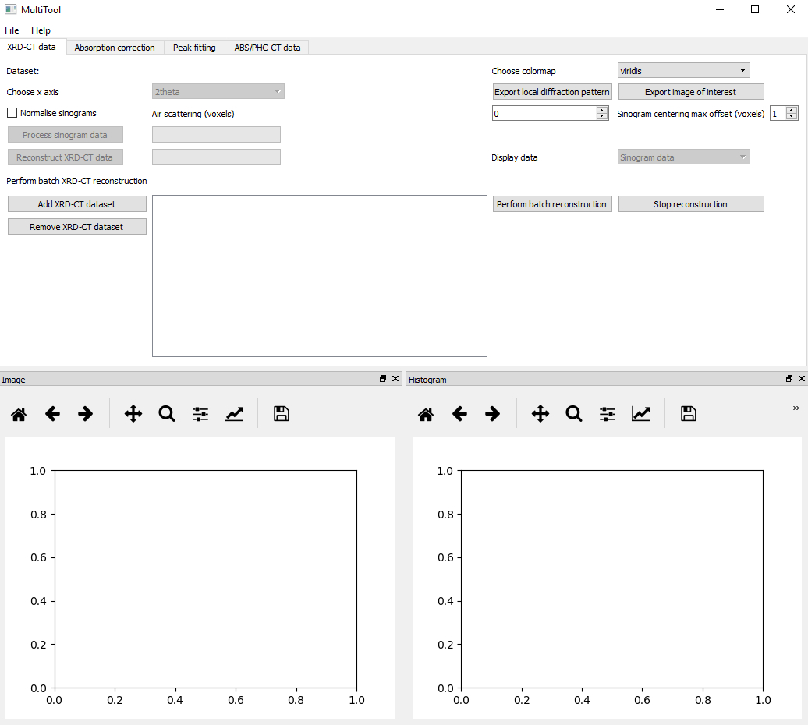
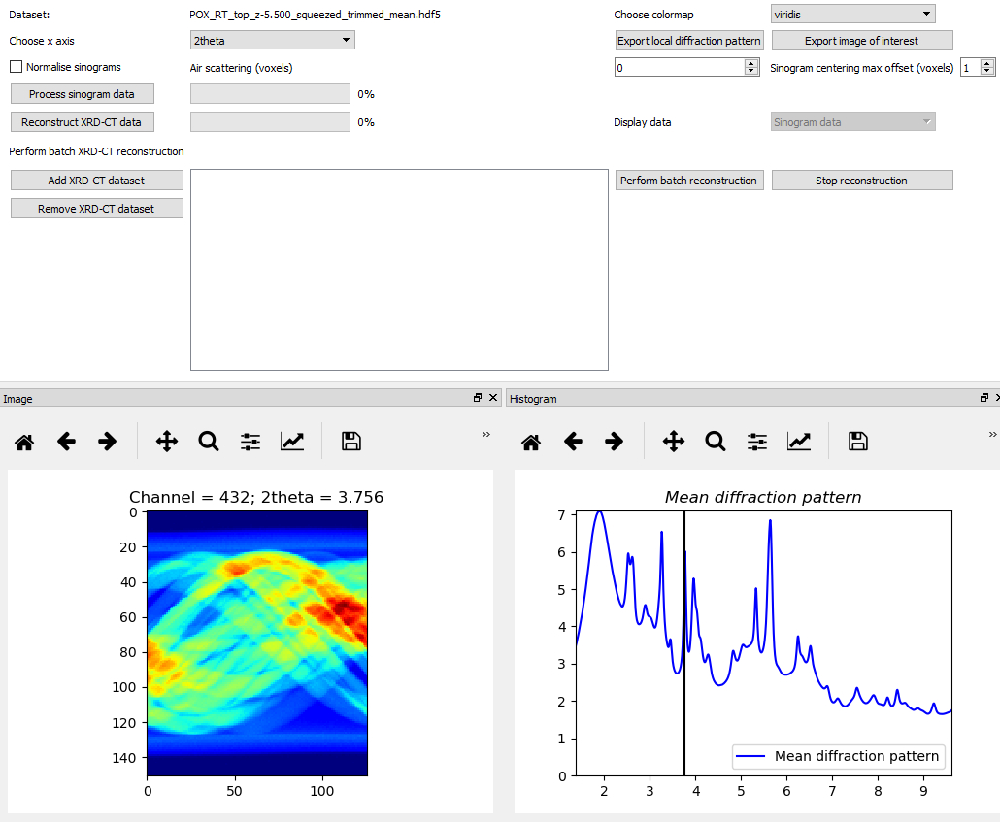
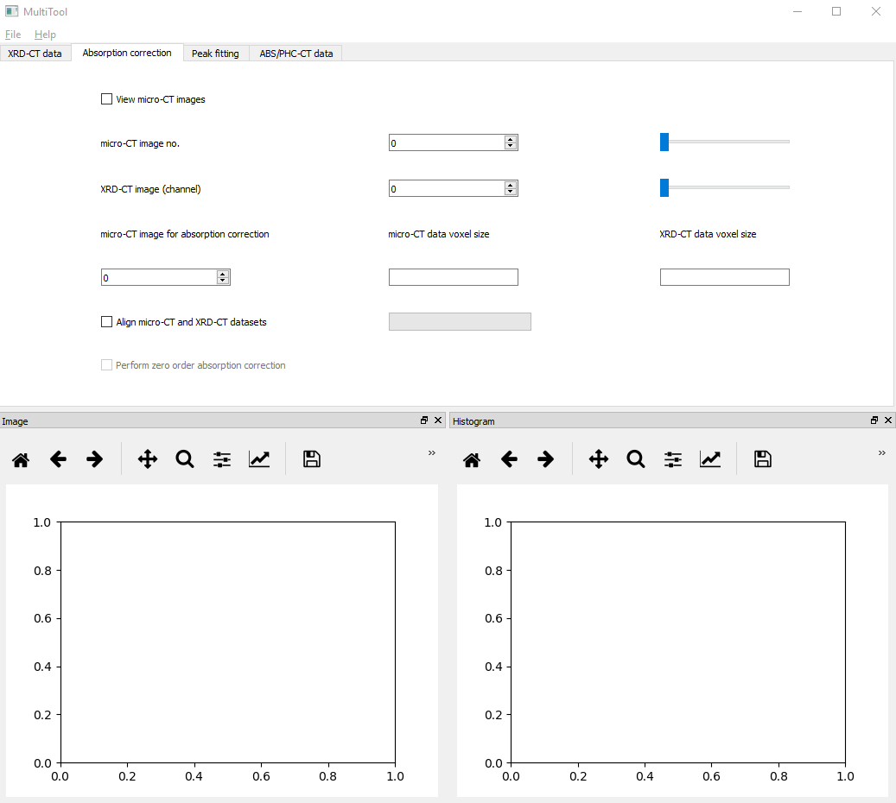
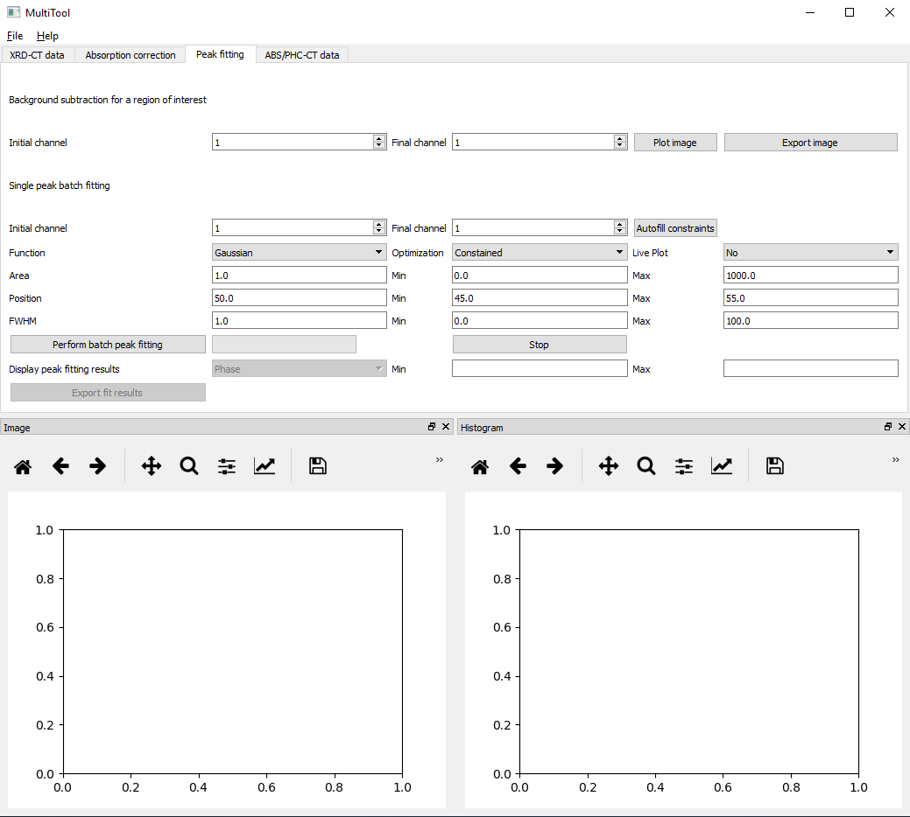
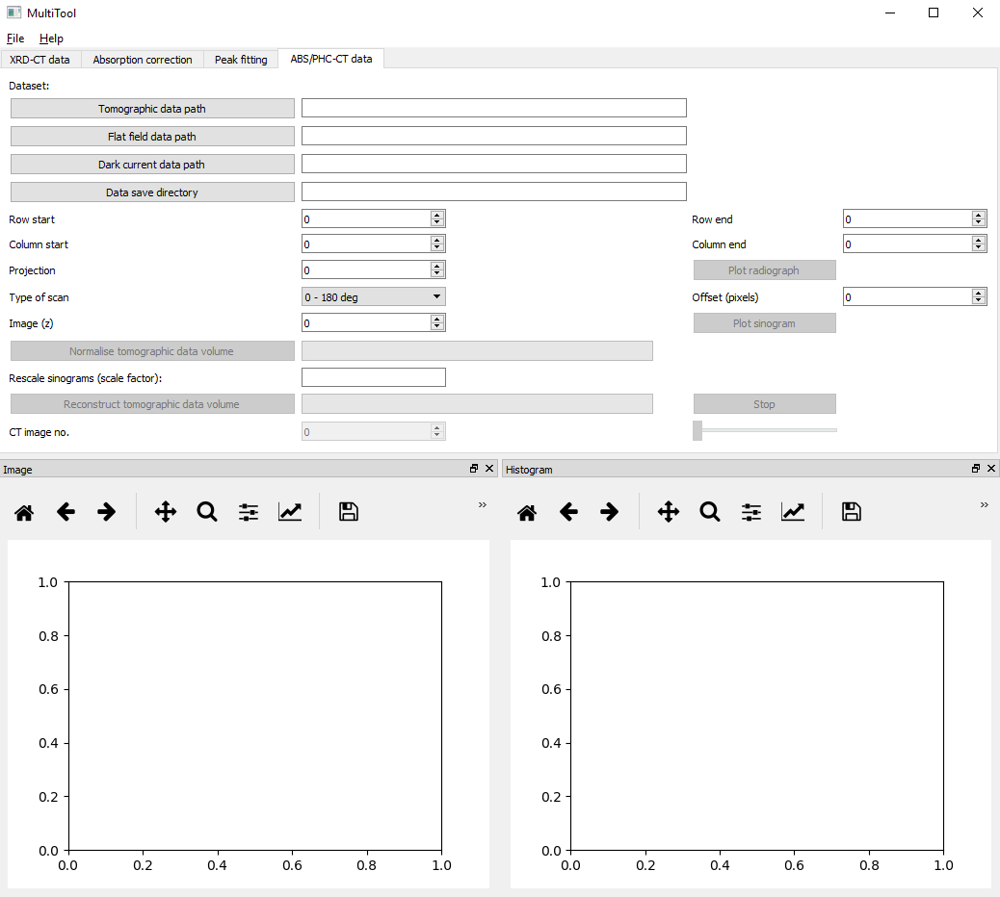

MultiTool tutorial
******************

The MultiTool GUI can be used to process and analyse X-ray computed tomography data. 
Although initially designed for processing X-ray diffraction computed tomograph data, as it will be shown in this tutorial it can be used to process data from different techniques.

Currently, there are four main tabs in MultiTool GUI:

1) XRD-CT data
2) Absorption correction
3) Peak fitting
4) ABS/PHC-CT data

XRD-CT data tab
---------------

This part of the MultiTool GUI focuses on the processing of the sinogram data volume and image reconstruction of X-ray diffraction computed tomography (XRD-CT) data.
The GUI loads .hdf5 (or .h5) files and it assumes that the data are stored as a 2D or 3D matrix. Specifically, it is expecting to find the following datasets present:

* '/data': The intensity data, this can be a 2D or a 3D matrix. The last dimension is assumed to be the spectral/scattering dimension
* '/twotheta': The 2theta axis used for the diffraction patterns
* '/q': The q spacing axis used for the diffraction patterns
* '/d': The d spacing axis used for the diffraction patterns
* '/slow_axis_steps': The number of steps used for the slow axis during the tomographic scan
* '/fast_axis_steps': The number of steps used for the fast axis during the tomographic scan
* '/scantype': The data acquisition strategy used during the tomographic scan. Options are: 'zigzag', 'fast' and 'interlaced'
* '/omega': The angles used during the tomographic scan
* '/y': The translation positions used during the tomographic scan
* '/energy': The energy of the X-rays used during the tomographic scan (in keV)
* '/diode': The values of the diode collected during the tomographic scan (monitors the beam flux)
* '/exptime': The values of the exposure time per point during the tomographic scan

Data visualisation
^^^^^^^^^^^^^^^^^^

The aforementioned datasets are automatically generated and stored in the .hdf5 files created with the Integrator GUI.
However, one can create custom .hdf5 files providing the '/data', '/twotheta', '/q' and '/d' datasets (data as a 3D matrix in this case) and the MultiTool GUI will be able to load the data.
This allows for data collected at other beamlines and synchrotron to be used with the MultiTool.

A screenshot of the XRD-CT data tab is shown below:

Once the data are loaded, the user is able to choose different colormaps and select the desired x axis (options are 2theta, q and q spacing).
The user can explore the data interactively by scrolling either in the spectral/scattering domain (the corresponding chemical images on the left figure are automatically updated) or by hovering the mouse over the image (the corresponding chemical signals on the right figure are automatically updated).
An example of XRD-CT sinogram data volume exploration is shown in the image below:

Left clicking on a pixel in the chemical images leads to keeping in memory the corresponding chemical signal. 
The user can then export this signal (e.g. local diffraction pattern) by clicking the corresponding button in the MultiTool GUI.
The data are export as .xy, .asc and .hdf5 files.
It is also possible to save a chemical image of interest. In this case, the image is saved both as an .png and and as a .hdf5 file.
Right clicking on a pixel in the chemical images resets the x axis on the right hand side figure (chemical signals).
Right clicking on the hand side figure (chemical signals) resets the black vertical line spectral guide (this is necessary when zooming in the signal).

Sinogram processing and image reconstruction
^^^^^^^^^^^^^^^^^^^^^^^^^^^^^^^^^^^^^^^^^^^^

There are three main features for sinogram preprocessing prior to image reconstruction:

* Normalise sinograms: Once enabled, the MultiTool assumes that the total (scattering) intensity per tomographic angle is constant. This is true is static measurements and during a zigzag scan but this option should be treated with care.
* Air scattering (voxels): The user can specify the number of voxels from each side of the sinograms to be used for background signal subtraction. For example, a value of 4 will lead to the following process: The mean chemical signal from the first and last 4 voxels per tomographic angle will be calculated and subtracted from the corresponding line scan dataset.
* Sinogram centering max offset (voxels): The maximum number of voxels to be used during the sinogram centering process. The global sinogram is calculated and the centering is performed by comparing the projection at 0 and at 180 degrees. The latter is flipped and interpolated until the difference between this and the first one is minimised.

The user should then perform the sinogram processing by clicking on the corresponding button in the MultiTool. The final step is the reconstruction of the chemical images.
The MultiTool GUI is using the filtered back projection (FBP) algorithm from the scikit-image package. However, it first performs a check if pyopencl is working properly and if so, it performs the reconstruction using the FBP with GPU from the silx package.
It is also possible to perform batch sinogram processing and image reconstruction of multiple datasets simultanesouly. This feature is typically used post experiment.

Absorption correction tab
-------------------------

This part of the MultiTool GUI focuses on the absorption correction of XRD-CT data. In this work, a zero order absorption correction is performed.
The user can interactively explore the micro-CT data (figure on the left hand side) and directly compare them with the XRD-CT data (figure on the right hand side).
A screeshot of the absorption correction tab is provided below:

The two sliders and the corresponding spinboxes are used to scroll along the third dimension in the micro-CT (third dimension is the height) and XRD-CT data (third dimension is the scattering domain).
This feature allows the users to find the micro-CT image that corresponds to the XRD-CT data.
The user tcan then specify the voxel size for the micro-CT and XRD-CT data.
The final part of this process performs the image registration of the two datasets and performs the absoprtion correction for the global XRD-CT image.

Peak fitting tab
----------------

This part of the MultiTool GUI focuses on the analysis of the reconstructed chemical images. Specifically, it allows for:

* Background subtraction for a region of interest
* Single peak batch fitting of an XRD-CT dataset

A screeshot of the absorption correction tab is provided below:

Background subtraction for a region of interest
^^^^^^^^^^^^^^^^^^^^^^^^^^^^^^^^^^^^^^^^^^^^^^^

This feature is very useful as it allows to quickly map different chemical species present in the XRD-CT data. 
The user specifies the region of interest by choosing the initial and final bin of this region.
The new image is calculated by summing the intensity over this spectral/scattering region and subtracting the mean intensity from the images corresponding to the first and last bins of this region.

Single peak batch fitting of an XRD-CT dataset
^^^^^^^^^^^^^^^^^^^^^^^^^^^^^^^^^^^^^^^^^^^^^^

The main feature of this part of the GUI is related to the single peak batch fitting. A Gaussian peak shape is chosen and the user needs to specify the following:

* Initial channel and final channel: The region that will be used during the peak fitting process
* Function: Peak shape functions. Options include Gaussian, Lorentzian and Pseudo-Voigt functions
* Area: The initial value for the peak area, the minimum and maxixum values for peak area
* Position: The initial value for the peak position, the minimum and maxixum values for peak position
* FWHM: The initial value for the full width at half maximum (FWHM), the minimum and maxixum values for the FWHM

The results can be exported as separate hdf5 files

ABS-CT data
---------------

This part of the MultiTool GUI is dedicated to reconstructing full field X-ray absorption CT data.
The user has to provide the following information:

1) Tomographic data path: Interactively provide the full path to where the tomographic data are stored
2) Flat field images path: Interactively provide the full path to where the flat field images are stored
3) Dark images path: Interactively provide the full path to where the dark images are stored
4) Data save directory: Interactively provide the directory where the results will be saved

A screeshot of the absorption correction tab is provided below:

The MultiTool GUI allows for interactive cropping of the radiographs prior to reconstruction. This is performed by adjusting the row start/end and column start/end values.
The use can also select a projection of interest and inspect/plot it (radiograph).

The MultiTool code allows for processing both conventional 0-180 deg scans and 0-360 deg scans. For the latter, the user has to adjust the value for the offset in order to optimise the data stiching process (i.e. sinogram).
The user can select an image of interest and plot the corresponding sinogram.

The next step is the normalisation of the whole tomographic dataset. The MultiTool GUI also allows for rescaling the data (e.g. in case one would like to decrease the size of the data).
Finally, the micro-CT data are reconstructed and saved as an .hdf5 file. The user is also able to directly inspect the results (i.e. reconstructed images) using the MultiTool GUI.
